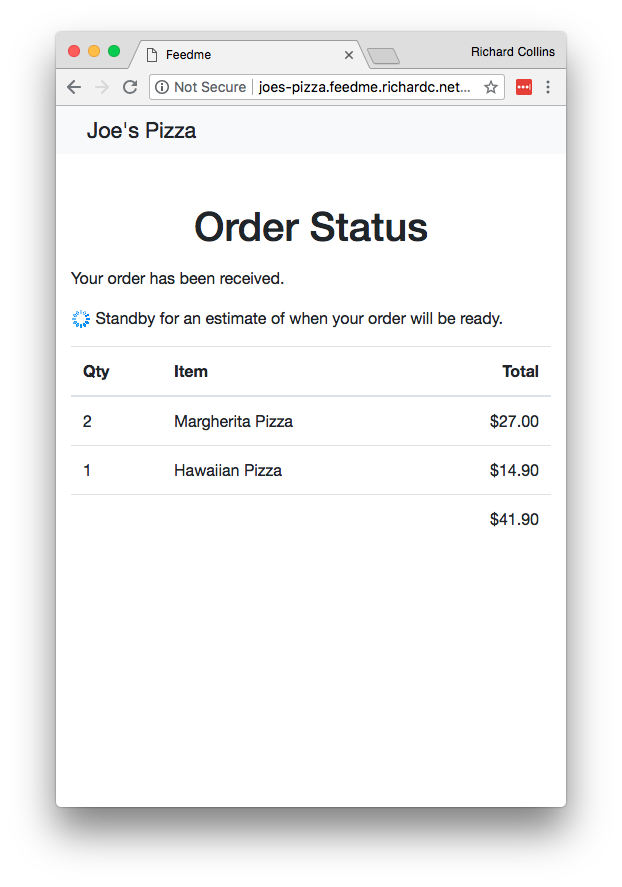
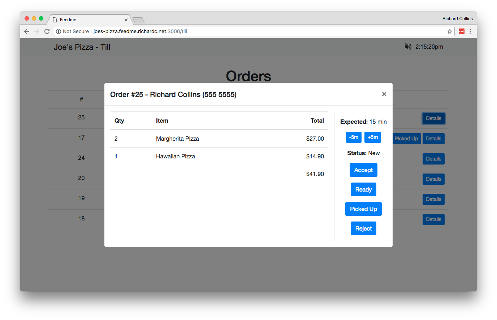

# Feedme

This is a side project I have been working on to learn [Elm](http://elm-lang.org/). The backend is implemented in [Go](https://golang.org/). It implements a multi-tenant takeaway ordering system for restaurants much like UberEats. So far it consists of:
 
 * Single page web app for restaurant customers
 * Single page web app for restaurant till
 * Admin pages

It is not a complete system, one notable missing part is any kind of authentication. In it's current state anyone can browse to the pages used by restaurants and administrators.

## Screenshots
 
Here are some screenshots so you can get an idea of the user experience. Clearly, it needs some attention from a graphic designer.

### Restaurant - Homepage

Simple one page website with everything you want from a restaurant:
 
 * Logo and Restaurant Name
 * Menu - this has buttons for making an order
 * Location and phone number
 * About Us section 

These screenshots are of a smaller browser window to show you what the site would look like on a smartphone.

### Restaurant - Order Confirmation

These screenshots show the order confirmation flow. The last page updates in real time as the order status changes.

Bogus orders could become a real problem. An invisible capture would probably deal with 99.9% of potential abuse without harming the user experience. Requiring Credit Card payment as part of the order process would also be an effective deterent.

### Restaurant - Cashier display

These screens show what the cashier at the restaurant would see. This would be on a tablet computer beside the till. Orders pop up in real time, the cashier reviews the order and taps buttons to indicate when it will be ready and to change the order status. The idea is to keep it as quick and easy as possible for the cashier.

Transfering the order to the regular till would be tedious for the cashier, but no worse than if the order comes in from a telephone call. Ideally you implement a complete till so the order does not need to be transfered at all - technically this is fairly straightforward and suitable integrated hardware can be had from AliExpress for around $US300 - the biggest challenge is probably persuading the restaurateur to switch to a completely different till.

### Admin Pages

These final screenshots are of the admin pages for adding restaurants. A complete system would be more elabourate, e.g. the ability to upload restaurant logos, and muchof this functionality would nned to be on admin pages the restaurateur has access to.

The edit menu page is kind of cool you edit the JSON and the menu updates as you type. However if the restaurateur had access to this, you couldn't have themedit raw JSON.

## Building

If you want to build this project yourself you will need:

 1. Install [Go compiler](https://golang.org/) 
 1. Install [Elm 0.18 Compiler](https://github.com/elm-lang/elm-platform/releases/tag/0.18.0-exp) - I will update to Elm 0.19 when all the dependencies have been updated. 
 1. Install [chronic](https://www.unix.com/man-page/debian/1/chronic/) CLI tool 
 1. Install NodeJS - it is used for for building stylesheets
 1. Install my [fork] (https://github.com/richardcrichardc/gin) of Gin build tool (`go get https://github.com/richardcrichardc/gin`)
 1. Install Postgres and create the database feedme (`createdb feedme`)
 1. Clone this repo (`go get github.com/richardcrichardc/gin`) and `cd` to the project directory 
 1. Install dependencies of stylesheet builder `npm install`
 1. `cp config.json.example` to `config.json` and update appropriately  
 1. From the project directory run `gin -all` 

This runs the development server on all network interfaces port 3000, with the app being rebuilt whenever the source is changed. I don't have a release build process yet. It is not the most straight forward process and may contain errors - open a issue if you get stuck on this and I will help you get it running.

To get started using the app browse to http://localhost/admin/restaurants. Once you have added a restaurant, you can click through to it, but this will not work until you have DNS set up for the restaurants. Restaurants are hosted on subdomains of the `DomainName` from `config.json`. You could add the domains to your `/etc/hosts/` file or if you have a handy domain name, add Global DNS records to your local machine like I have:

